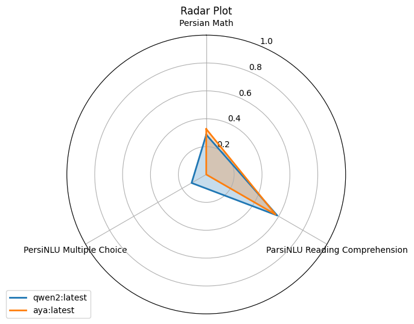

# ParsBench

ParsBench provides toolkits for benchmarking Large Language Models (LLMs) based on the Persian language. It includes various tasks for evaluating LLMs on different topics, benchmarking tools to compare multiple models and rank them, and an easy, fully customizable API for developers to create custom models, tasks, scores, and benchmarks.

## Key Features

- **Variety of Tasks**: Evaluate LLMs across various topics.
- **Benchmarking Tools**: Compare and rank multiple models.
- **Customizable API**: Create custom models, tasks, scores, and benchmarks with ease.

## Motivation

I was trying to fine-tune an open-source LLM for the Persian language. I needed some evaluation to test the performance and utility of my LLM. It leads me to research and find [this paper](https://arxiv.org/abs/2404.02403). It's great work that they prepared some datasets and evaluation methods to test on ChatGPT. They even shared their code in this [repository](https://github.com/Ipouyall/Benchmarking_ChatGPT_for_Persian).

So, I thought that I should build a handy framework that includes various tasks and datasets for evaluating LLMs based on the Persian language.

## Installation

Install [Math Equivalence](https://github.com/hendrycks/math) package manually:

```bash
pip install git+https://github.com/hendrycks/math.git
```

Install ParsBench using pip:

```bash
pip install parsbench
```

## Usage

### Evaluating a PreTrained Model

Load the pre-trained model and tokenizer from the HuggingFace and then, evaluate the model using the PersianMath task:

```python
from transformers import AutoModelForCausalLM, AutoTokenizer

from parsbench.models import PreTrainedTransformerModel
from parsbench.tasks import PersianMath

model = AutoModelForCausalLM.from_pretrained(
    "Qwen/Qwen2-72B-Instruct",
    torch_dtype="auto",
    device_map="auto"
)
tokenizer = AutoTokenizer.from_pretrained("Qwen/Qwen2-72B-Instruct")

tf_model = PreTrainedTransformerModel(model=model, tokenizer=tokenizer)

with PersianMath() as task:
    results = task.evaluate(tf_model)
```

### Benchmarking Multiple Models with Multiple Tasks

For example, we run our local models using Ollama:

```bash
ollama run qwen2
ollama run aya
```

Then we benchmark those models using the ParsBench.

```python
from parsbench.models import OpenAIModel
from parsbench.tasks import ParsiNLUMultipleChoice, PersianMath, ParsiNLUReadingComprehension

qwen2_model = OpenAIModel(
    api_base_url="http://localhost:11434/v1/",
    api_secret_key="ollama",
    model="qwen2:latest",
)
aya_model = OpenAIModel(
    api_base_url="http://localhost:11434/v1/",
    api_secret_key="ollama",
    model="aya:latest",
)

benchmark = CustomBenchmark(
    models=[qwen2_model, aya_model],
    tasks=[
        ParsiNLUMultipleChoice,
        ParsiNLUReadingComprehension,
        PersianMath,
    ],
)
result = benchmark.run(
    prompt_lang="fa",
    prompt_shots=[0, 3],
    n_first=100,
    sort_by_score=True,
)
result.show_radar_plot()
```



## Available Tasks

| Task Name                   | Score Name       | Dataset      |
|-----------------------------|------------------|--------------|
| ParsiNLU Sentiment Analysis | Exact Match (F1) | [ParsiNLU](https://huggingface.co/datasets/persiannlp/parsinlu_sentiment) |
| ParsiNLU Entailment | Exact Match (F1) | [ParsiNLU](https://huggingface.co/datasets/persiannlp/parsinlu_entailment) |
| ParsiNLU Machine Translation En -> Fa | Bleu | [ParsiNLU](https://huggingface.co/datasets/persiannlp/parsinlu_translation_en_fa) |
| ParsiNLU Machine Translation Fa -> En | Bleu | [ParsiNLU](https://huggingface.co/datasets/persiannlp/parsinlu_translation_fa_en) |
| PersiNLU Multiple Choice | Exact Match (Accuracy) | [ParsiNLU](https://github.com/persiannlp/parsinlu) |
| ParsiNLU Reading Comprehension | Common Tokens (F1) | [ParsiNLU](https://huggingface.co/datasets/persiannlp/parsinlu_reading_comprehension) |
| Persian NER | NER Exact Match (F1) | [ParsiNLU](https://github.com/HaniehP/PersianNER) |
| Persian Math | Math Equivalence (Accuracy) | [Source](https://github.com/Ipouyall/Benchmarking_ChatGPT_for_Persian) |
| ConjNLI Entailment | Exact Match (F1) | [Source](https://github.com/Ipouyall/Benchmarking_ChatGPT_for_Persian) |

You can import the class of above tasks from `parsbench.tasks` and use it for evaluating your model.

## Contributing

Contributions are welcome! Please refer to the [contribution guidelines](contribution.md) for more information on how to contribute.

## License

ParsBench is distributed under the MIT License.

## Contact Information

For support or questions, please contact: [shahriarshm81@gmail.com](mailto:shahriarshm81@gmail.com)
Feel free to let me know if there are any additional details or changes you'd like to make!
