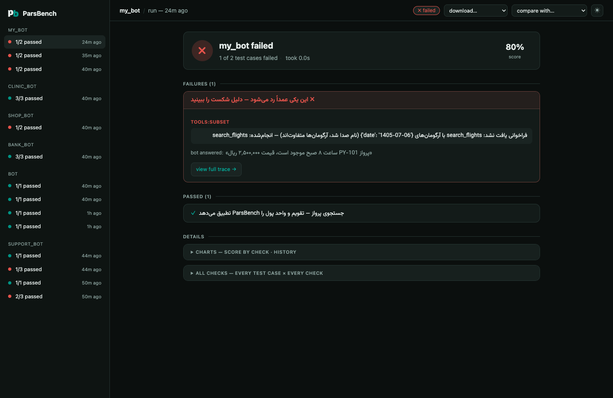

# Evaluating your AI app

ParsBench's app evaluation layer tests **your Persian chatbot or agent** —
whatever framework it is built with. It is the part of ParsBench you wire into
CI so a prompt tweak that breaks tool calls, leaks a forbidden answer, or
quotes the wrong price never reaches production.

English-shaped eval harnesses silently fail on Persian apps: they treat
«۲۵۰ هزار تومان» and «۲٬۵۰۰٬۰۰۰ ریال» as different answers, «۵ مهر ۱۴۰۵» and
`2026-09-27` as different dates, and «می‌روم» / «می روم» / «میروم» as different
words. ParsBench's normalization layer makes those equivalences hold in every
check, on both text answers and tool-call arguments.

Like the rest of ParsBench, the API is class-based: an `AppEvaluator` holds
your goldens the way a `Task` holds its dataset, and `evaluate()` takes the
thing under test — your app instead of a model.

## Sixty seconds, no API key

Your app is any function that takes a user message and returns a string, a
`Trace`, or an OpenAI-format message list:

```python
from parsbench.appeval import AppEvaluator, Golden, ToolCall

def my_bot(message):          # stand-in for your app
    return [
        {"role": "assistant", "tool_calls": [
            {"id": "1", "function": {"name": "search_flights",
                                     "arguments": '{"date": "1405-07-05"}'}}]},
        {"role": "tool", "tool_call_id": "1", "content": "پرواز PY-101"},
        {"role": "assistant", "content": "پرواز ساعت ۸ صبح، قیمت ۲٬۵۰۰٬۰۰۰ ریال"},
    ]

evaluator = AppEvaluator(goldens=[
    Golden(
        input="بلیط تهران-مشهد برای ۵ مهر ۱۴۰۵ می‌خوام. قیمتش چنده؟",
        tools=[ToolCall("search_flights", date="2026-09-27")],  # Jalali == Gregorian
        contains=["250 هزار تومان"],                            # rials == tomans
        forbidden_tools=["book_flight"],
    ),
])
result = evaluator.evaluate(my_bot)
print(result)
```

Every filled `Golden` field switches on its check — there is no separate
metric configuration and no YAML.

## Two ways in

```python
# 1. run-for-me: hand evaluate() your function (sync or async)
result = evaluator.evaluate(bot)

# 2. traces mode: run the app yourself, score what happened
result = evaluator.score_traces([trace_or_message_list])
```

A crash inside your app is reported as a failing `app_error` check on that
golden — one broken case never aborts the suite. Async apps work everywhere,
including notebooks and servers with a running event loop.

## Golden fields

| Field | Check | Passes when |
|---|---|---|
| `output=` | `correctness` | a judge scores the answer consistent with the reference |
| `contains=[...]` | `contains` | each needle appears — normalized, money- and date-equivalent |
| `not_contains=[...]` | `not_contains` | no needle appears (same equivalences) |
| `format=Model` | `format` | the output parses/validates against a pydantic schema |
| `tools=[ToolCall(...)]` | `tools` | expected calls happened; args compared date→number→text |
| `forbidden_tools=[...]` | `forbidden_tools` | none of these tools were called |
| `context=[...]` | `faithfulness` | a judge finds every claim supported by the context |
| `refuses=True` | `refusal` | a judge confirms the request was declined |
| `max_steps/latency/cost` | `budget:*` | the trace stayed within the budget |
| `check=fn` | `custom` | your `Trace -> bool | float` returns truthy/1.0 |

`AppEvaluator(goldens, metrics=["tools:strict", "contains"])` filters or
re-modes checks; unknown names raise instead of silently passing, and Golden
field names (`max_steps`, `refuses`, …) work as aliases.

## The judge

Deterministic checks always run. Judge checks (`output=`, `context=`,
`refuses=`) need a judge model and **skip gracefully** without one:

```bash
export PARSBENCH_JUDGE=gpt-4.1-mini      # any OpenAI-compatible model name
export OPENAI_BASE_URL=...               # AvalAI, OpenRouter, Ollama, …
export OPENAI_API_KEY=...
# or judge-specific: PARSBENCH_JUDGE_BASE_URL / PARSBENCH_JUDGE_API_KEY
```

`judge=` also accepts any parsbench `Model` (e.g. an `OpenAIModel`) or a plain
`prompt -> str` callable. Judge prompts are authored in Persian and importable
(`parsbench.appeval.prompts_fa`) if you want to edit the rubrics. The built-in
client retries transient failures and bounds each call
(`PARSBENCH_MAX_RETRIES`, `PARSBENCH_TIMEOUT` override the defaults of 5 and
120s). Before trusting judge scores at scale,
[calibrate them](#calibrating-the-judge).

## Frameworks

Every adapter is duck-typed — importing it never requires the framework:

```python
from parsbench.integrations import openai_agents, langgraph, pydantic_ai, agno

trace = openai_agents.to_trace(run_result)     # OpenAI Agents SDK RunResult
trace = langgraph.to_trace(state)              # LangGraph graph state
trace = pydantic_ai.to_trace(result)           # Pydantic AI AgentRunResult
trace = agno.to_trace(run)                     # Agno RunOutput
```

Anything OTel-instrumented (CrewAI, LlamaIndex, Google ADK, instrumented
LangChain) feeds through the universal collector — no adapter needed:

```python
from parsbench.integrations.otel import TraceCollector

collector = TraceCollector()
tracer_provider.add_span_processor(collector)
...   # run your app
result = evaluator.score_traces([collector.to_trace()])
```

Runnable end-to-end examples for each framework live in
[`examples/`](https://github.com/ParsBench/ParsBench/tree/main/examples), and
[`examples/industry/`](https://github.com/ParsBench/ParsBench/tree/main/examples/industry)
shows vertical-specific evaluations — banking, e-commerce, healthcare, telecom
simulation, and knowledge-base RAG.

## Multi-turn simulation

`SimulationEvaluator` drives your bot with an LLM playing an Iranian user —
taarof openings, toman/rial confusion, Jalali dates, Finglish switches, typos
— then judges the finished conversation against the goal:

```python
from parsbench.appeval import SimulationEvaluator

evaluator = SimulationEvaluator(
    goal="خرید بسته اینترنت یک‌ماهه و دانستن قیمت آن",
    user="محاوره‌ای+toman_rial_confusion+finglish_switch",
    criteria=["قیمت به کاربر اعلام شود"],
    simulator_model="gpt-4.1-mini",           # the user simulator
    judge="gpt-4.1-mini",
)
result = evaluator.evaluate(my_bot)           # fn(message) or fn(message, history)
```

`parsbench.appeval.TRAPS` lists the named behaviors; free text in the `user=`
string becomes extra instructions for the simulated user. For finer control,
pass a `PersianUser(style=..., persona=..., traps=[...])` and
`ConversationGolden` objects.

## Generating goldens from your docs

```python
from parsbench.appeval import GoldenGenerator

goldens = GoldenGenerator(model="gpt-4.1-mini", adversarial=True).generate("kb/", n=30)
result = AppEvaluator(goldens).evaluate(my_bot)
```

Questions come in both formal and colloquial register; `adversarial=True`
mixes digit scripts, Jalali dates and Finglish. Generated goldens carry their
source chunk as `context=`, so faithfulness is judged automatically.

## Calibrating the judge

Before publishing judge-scored numbers, measure judge-vs-human agreement on a
labeled sample:

```python
from parsbench.appeval import JudgeCalibrator

calibration = JudgeCalibrator(judge="gpt-4.1-mini").calibrate(
    [{"golden": Golden(input="...", output="..."), "output": "...", "human": True}, ...],
    prefer_concurrency=True, n_workers=8,
)
print(calibration)     # agreement, Cohen's kappa, readable disagreements
```

## CI

`result.assert_passed()` raises with the failing checks, so goldens are plain
pytest cases (see [`examples/ci_with_pytest.py`](https://github.com/ParsBench/ParsBench/blob/main/examples/ci_with_pytest.py)):

```python
@pytest.mark.parametrize("golden", GOLDENS, ids=lambda g: g.label)
def test_bot(golden):
    AppEvaluator(goldens=[golden]).evaluate(bot).assert_passed()
```

Run them with `pytest` or `parsbench test` (install via `pip install
'parsbench[test]'`). For flaky agents, `evaluate(bot, n_runs=5)` repeats each
golden and `result.pass_hat_k()` gives the tau²-style consistency score;
`evaluate(bot, prefer_concurrency=True, n_workers=8)` fans independent goldens
out over threads (your app and judge must then be thread-safe).

Results are plain dataclasses with the same conveniences as benchmark
results: `result.to_pandas()`, `result.save(output_path)` (also available as
`evaluate(..., save_evaluation=True, output_path=...)`),
`result.diff("out/app_evaluation.jsonl")` to track regressions between runs,
and `result.to_langfuse()` to push per-check scores to a Langfuse instance
(`LANGFUSE_HOST` / `LANGFUSE_PUBLIC_KEY` / `LANGFUSE_SECRET_KEY`).

## Viewing runs — `parsbench view`

Every `evaluate()` and `score_traces()` call records its run — full traces
included — into a project-local `.parsbench/` store (self-gitignored, plain
`run.json` + `events.jsonl` files). Open the viewer:

    parsbench view



- **Live**: runs stream into the UI while they execute; finished runs stay
  as the archive.
- **Checks matrix**: goldens × checks with the judge's Persian reasons one
  click away.
- **Trace detail**: messages, tool calls (arguments/results/errors),
  latency and steps — plus per-run tabs when `n_runs > 1`.
- **Simulation replay**: the conversation as an RTL chat, with the goal and
  traps in play.
- **Compare**: pick a baseline run to see which goldens regressed and how
  each check's mean moved.
- **Export**: download any run as JSON (full traces), CSV (one row per
  check, Excel-safe UTF-8), or a paste-ready Markdown report.
- **Charts**: an optional diagrams section — score per check and the app's
  score history across runs. Dark and light themes, toggle in the top bar.

Recording is on by default; turn it off per call with `record=False` or
globally with the `PARSBENCH_NO_RECORD=1` env var (e.g. in CI). Delete
`.parsbench/` whenever you like — it is only the viewer's data.
