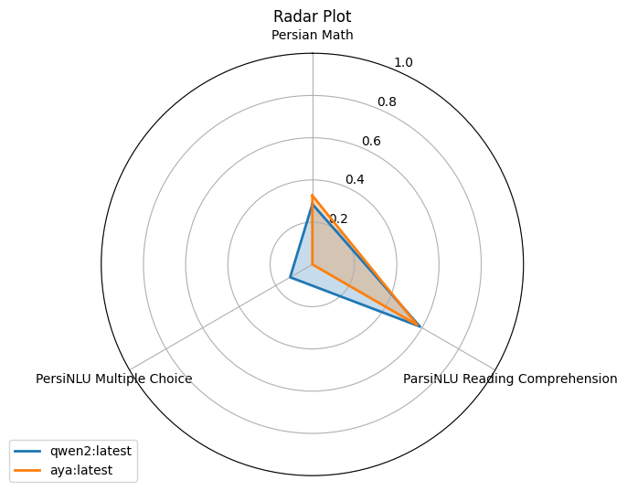

# Getting Started

## Installation

> **Requires Python ≥ 3.12.** ParsBench 0.2+ targets current library versions
> (transformers 5, datasets 5, numpy 2), which need Python 3.12+. If you're on
> Python 3.10/3.11, pin the previous release: `pip install "parsbench==0.1.7"`.

Install ParsBench using pip:

```bash
pip install parsbench
```

Two optional extras, depending on what you're doing:

- `pip install 'parsbench[test]'` also installs pytest, so you can run golden
  suites with `parsbench test` in CI.
- The [Persian Math](https://github.com/hendrycks/math) benchmark task
  additionally needs the Math Equivalence package, installed manually:
  `pip install git+https://github.com/hendrycks/math.git`

## Pick your path

ParsBench does two different jobs. Pick the one you came for:

- **"I'm building a Persian chatbot/agent and want to test it"** →
  [evaluate your app](#evaluate-your-app-60-seconds-no-api-key) below, then
  the [App Evaluation](app-eval.md) docs.
- **"I have a model and want to know how good it is at Persian"** →
  [benchmark a model](#benchmark-a-model) below, then the
  [Benchmarking tutorial](tutorial/models.md).

## Evaluate your app (60 seconds, no API key)

Your app is any function that takes a user message and returns a string, a
`Trace`, or an OpenAI-format message list. Write down what a good answer looks
like as `Golden` objects, and evaluate:

```python
from parsbench.appeval import AppEvaluator, Golden, ToolCall

def my_bot(message):          # stand-in for your app
    return [
        {"role": "assistant", "tool_calls": [
            {"id": "1", "function": {"name": "search_flights",
                                     "arguments": '{"date": "1405-07-05"}'}}]},
        {"role": "tool", "tool_call_id": "1", "content": "پرواز PY-101"},
        {"role": "assistant", "content": "پرواز ساعت ۸ صبح، قیمت ۲٬۵۰۰٬۰۰۰ ریال"},
    ]

evaluator = AppEvaluator(goldens=[
    Golden(
        input="بلیط تهران-مشهد برای ۵ مهر ۱۴۰۵ می‌خوام. قیمتش چنده؟",
        tools=[ToolCall("search_flights", date="2026-09-27")],  # Jalali == Gregorian
        contains=["250 هزار تومان"],                            # rials == tomans
        forbidden_tools=["book_flight"],
    ),
])
result = evaluator.evaluate(my_bot)
print(result)
```

Every filled `Golden` field switches on its check. There is no separate
metric configuration and no YAML. The deterministic checks (tools, contains,
format, budgets) run with no API key at all; add a
[judge model](app-eval/judge.md) when you want LLM-judged correctness,
faithfulness, and refusal checks too.

Then open the local viewer to browse the run, traces included:

```bash
parsbench view
```

Continue with the [App Evaluation overview](app-eval.md).

## Benchmark a model

### Evaluating a pre-trained model

Load a model and tokenizer from HuggingFace, then evaluate on a task, here
Persian Math:

```python
from transformers import AutoModelForCausalLM, AutoTokenizer

from parsbench.models import PreTrainedTransformerModel
from parsbench.tasks import PersianMath

model = AutoModelForCausalLM.from_pretrained(
    "Qwen/Qwen2-72B-Instruct",
    torch_dtype="auto",
    device_map="auto"
)
tokenizer = AutoTokenizer.from_pretrained("Qwen/Qwen2-72B-Instruct")

tf_model = PreTrainedTransformerModel(model=model, tokenizer=tokenizer)

with PersianMath() as task:
    results = task.evaluate(tf_model)
```

### Benchmarking multiple models on multiple tasks

Any OpenAI-compatible API works, so local models via Ollama are one line each:

```bash
ollama run qwen2
ollama run aya
```

Then benchmark them:

```python
from parsbench.benchmarks import CustomBenchmark
from parsbench.models import OpenAIModel
from parsbench.tasks import ParsiNLUMultipleChoice, PersianMath, ParsiNLUReadingComprehension

qwen2_model = OpenAIModel(
    api_base_url="http://localhost:11434/v1/",
    api_secret_key="ollama",
    model="qwen2:latest",
)
aya_model = OpenAIModel(
    api_base_url="http://localhost:11434/v1/",
    api_secret_key="ollama",
    model="aya:latest",
)

benchmark = CustomBenchmark(
    models=[qwen2_model, aya_model],
    tasks=[
        ParsiNLUMultipleChoice,
        ParsiNLUReadingComprehension,
        PersianMath,
    ],
)
result = benchmark.run(
    prompt_lang="fa",
    prompt_shots=[0, 3],
    n_first=100,
    sort_by_score=True,
)
result.show_radar_plot()
```



Continue with the [Benchmarking tutorial](tutorial/models.md).

## Troubleshooting

**"I can't reach the OpenAI API from Iran."** Every API-based piece of
ParsBench (models, the judge, the user simulator) speaks the OpenAI protocol,
so point it at any OpenAI-compatible gateway: [AvalAI](https://avalai.ir/),
[OpenRouter](https://openrouter.ai/), or a local
[Ollama](https://ollama.com/).

```bash
export OPENAI_BASE_URL=https://api.avalai.ir/v1
export OPENAI_API_KEY=...
```

**Judge checks show as "skipped".** Judge-based checks (`output=`,
`context=`, `refuses=`) need a judge model and skip gracefully without one.
Set `PARSBENCH_JUDGE` to any model name your gateway serves; see
[The Judge](app-eval/judge.md).

**`import parsbench` fails on `math_equivalence`.** You only need that
package for the Persian Math benchmark task; install it as shown under
[Installation](#installation).

**Dataset downloads fail.** Benchmark task datasets come from the HuggingFace
Hub; set `HF_ENDPOINT` to a mirror if the hub is unreachable from your
network.
